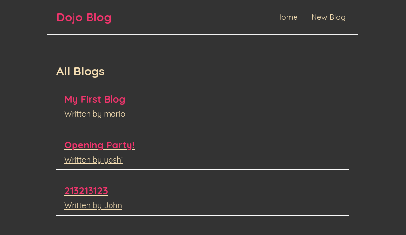

# Dojo Blog App
A Simple Blog Web single page app with the ability to fetch from an API server written in React.
___

## Setup
First run this client with
```bash
$ npm run start
```

Then clone the repository named [blog-api](https://github.com/notkearash/blog-api) make sure you set that up correctly and run
```bash
$ npm run dev
```
**Make sure you are in that repo directory**

## Notes
 + Quick and Dirty Project
 + This should be a CRUD client but I guess I forgot to add the D :D

MIT Licensed